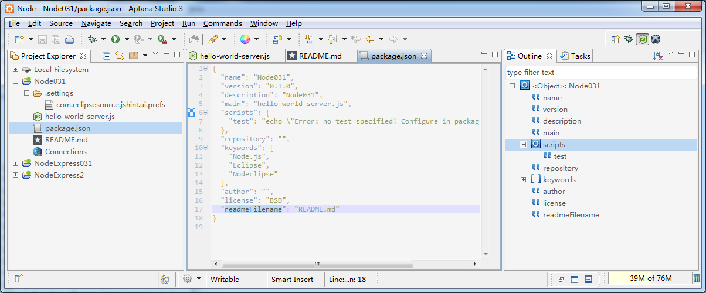
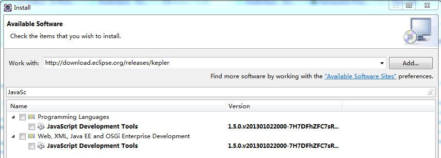
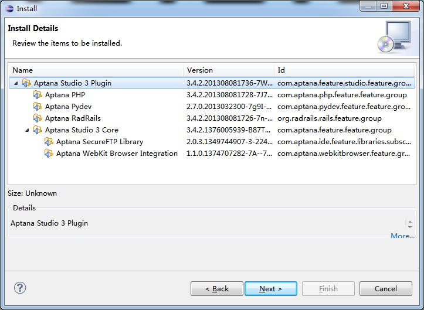
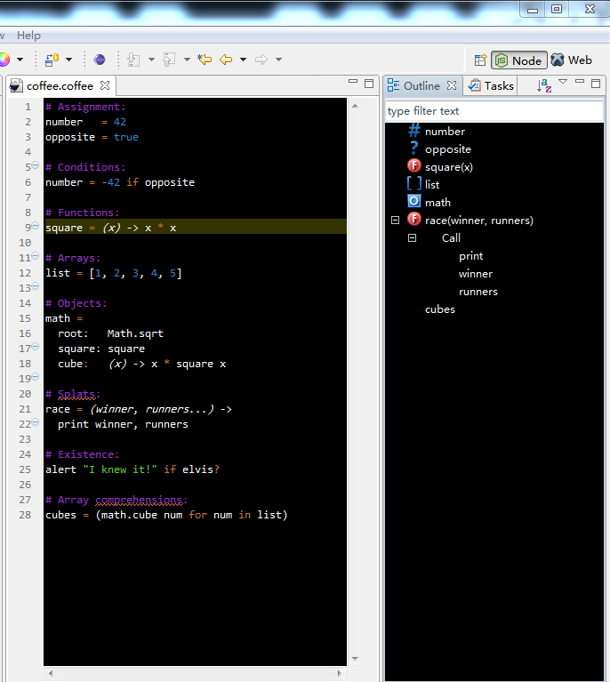

[See other Hints](https://github.com/Nodeclipse/eclipse-node-ide/blob/master/Hints.md#hints)

## Hints Aptana

### Aptana Studio

Before 0.4 was issue [#15 Support black background color schemes](https://github.com/Nodeclipse/nodeclipse-1/issues/15).
Could be walked around by installing [Eclipse Color Theme](http://marketplace.eclipse.org/content/eclipse-color-theme) 
 and changing theme to [Roboticket](http://eclipsecolorthemes.org/?view=theme&id=93) or other white background.
Window->Preferences->General->Appearance->Color Theme

When debugging, the issue [#15](https://github.com/Nodeclipse/nodeclipse-1/issues/15) is still present, when Chromium Editor (JS Editor) is opened.
For your own sources be sure to use Nodeclipse Editor.

Aptana uses also cannot simply install Nodeclipse plugin, as Aptana will not resolute to get required (since 0.4) JSDT dependency.
The first solution is provided in [Enide](http://marketplace.eclipse.org/content/enide-eclipse-nodejs-ide) is NJSDT (alternative to JSDT),
 or manually from `https://bitbucket.org/nexj/updatesite/raw/default` for NJSDT+NJSDoc (thanks to @johnpeb)  
The second solution is to install first JSDT from Eclipse Indigo update site `http://download.eclipse.org/releases/indigo`
(Juno and Kepler have conflicting dependency with Aptana Studio 3.4.2
( ~~`http://download.eclipse.org/releases/juno` or `http://download.eclipse.org/releases/kepler`~~ ) )
Effect of this is that you can't use latest JDST in Aptanta Studio.

Or you can take [Nodeclipse NTS](http://www.nodeclipse.org/nts/) and add [Aptana plugins](http://aptana.com/downloads/start)
 (Update Site URL: <http://download.aptana.com/studio3/plugin/install>).
Unfortunately you only can install the whole bunch of plugins (no options).
 
 

With this you have Aptana on top of Eclipse 4.x with latest plugins (EGit, JSDT etc)
But you will also need some time to configure UI (color themes and so on)

#### Aptana CoffeeScript support

Aptana has simple but nice Editor. No syntax check, but good outline.

