# Hints

[How can you speed up Eclipse?][1]

  [1]: http://stackoverflow.com/questions/316265/how-can-you-speed-up-eclipse

## Eclipse Distributions

You can get Nodeclipse plugin in any Eclipse-based IDE. Recommended are [standard Eclipse distributions](http://www.eclipse.org/downloads/)
 or [Nodeclipse NTS](http://www.nodeclipse.org/nts/) for Windows (where it is already pre-installed).

### Adobe Flex Builder

Nodeclipse runs perfectly well inside Adobe Flex Builder

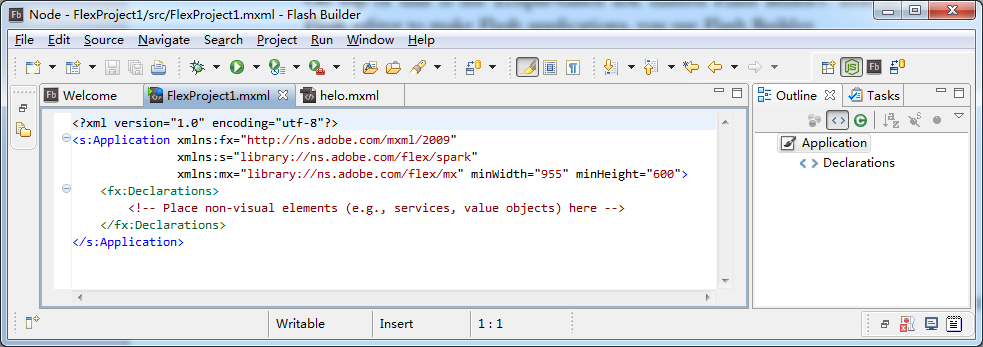

### Aptana Studio

Aptana Studio hints are now on [separate page Hints-Aptana.md](https://github.com/Nodeclipse/eclipse-node-ide/blob/master/Hints-Aptana.md#hints-aptana)

### Nodeclipse & Enide Studio

Nodeclipse NTS is Eclipse distribution.
[Nodeclipse NTS](http://www.nodeclipse.org/nts/) currently is only for Windows.

## Select JVM for Eclipse instance

Add -vm option in [eclipse.ini](http://wiki.eclipse.org/Eclipse.ini), that is in Eclipse folder. Quote:

	Note the format of the -vm option - it is important to be exact:
    	The -vm option and its value (the path) must be on separate lines.
    	The value must be the full absolute or relative path to the Java executable, not just to the Java home directory.
    	The -vm option must occur before the -vmargs option, since everything after -vmargs is passed directly to the JVM. 

Example:

	...
	-vm
	C:\Program Files\Java\jdk1.7.0_11\bin\javaw.exe
	-vmargs
	-Xms40m
	-Xmx512m

Using `jvm.dll` is [advised][1] to be faster: 

	-vm
	C:\Program Files\Java\jdk1.7.0_11\jre\bin\server\jvm.dll

## Editors

### JavaScript Editors

In Eclipse ecosystem there are a lot of JavaScript Editors. Some examples:

- JSDT project
- VJET project
- Nodeclipse ships with it's own Node Editor and ...
- JS Editor (from Chromium project)

### JavaScript Code Assist

Eclipse standard [JavaScript Development Tools (JSDT)](http://www.eclipse.org/webtools/jsdt/)
 ([wiki](http://wiki.eclipse.org/JSDT))
 already includes JavaScript Editor with Code/Content Assist function.  
 
Go to Preferences->JavaScript->Editor->Content Assist 

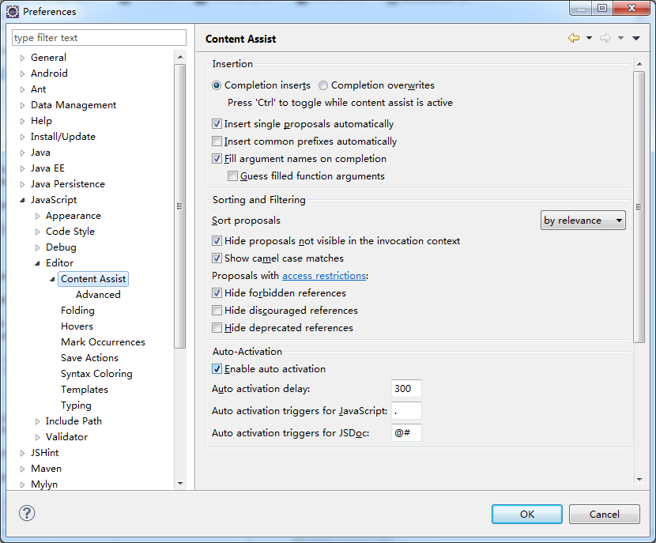

> **Inferred Types**
> 
> In order for some JDT-based functionality (such as code completion) to work correctly,
> class type information needs to be available. This information is not available in JavaScript,
> but it can be inferred in many cases.

Code assist for some libraries and framework is provided as extensions, for example
[Code assist for jQuery](http://marketplace.eclipse.org/content/jsdt-jquery).

### CoffeeScript Editor

Check <http://coffeescript.org/> for intro about CoffeeScript.

```coffeescript
	# Assignment:
	number   = 42
	opposite = true
	
	# Conditions:
	number = -42 if opposite
	
	# Functions:
	square = (x) -> x * x
	
	# Arrays:
	list = [1, 2, 3, 4, 5]
	
	# Objects:
	math =
	  root:   Math.sqrt
	  square: square
	  cube:   (x) -> x * square x
	
	# Splats:
	race = (winner, runners...) ->
	  print winner, runners
	
	# Existence:
	alert "I knew it!" if elvis?
	
	# Array comprehensions:
	cubes = (math.cube num for num in list)
```

Use [CoffeeScriptSet.p2f](https://raw.github.com/Nodeclipse/eclipse-node-ide/master/CoffeeScriptSet.p2f)
to [quickly install](http://marketplace.eclipse.org/content/coffeescript-editor-quick-installer).  
Warning: this plugin created by Adam Schmideg was not updated for a year.
see [About CoffeeScript support in Nodeclipse](http://www.nodeclipse.org/2013/06/02/Coffee.html)

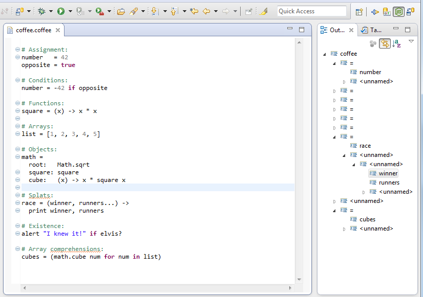


### JSON Editor

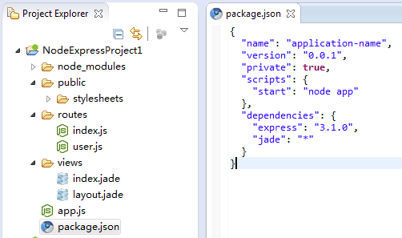

JSON means JavaScript Object Notation, so you just have to have any JavaScript editor 
and associate the *.json files with it (this is default since Nodeclipse 0.4):

    Window > Preferences
    General > Editors > File Associations
    Add... > File type: *.json
    Select *.json file type > Add... (Associated editors) > JavaScript Editor
    Make it default

Now you can now open JSON files with the JavaScript editor (with syntax highlight),
 use the formatter and set your favorite color theme with Eclipse Color Theme.

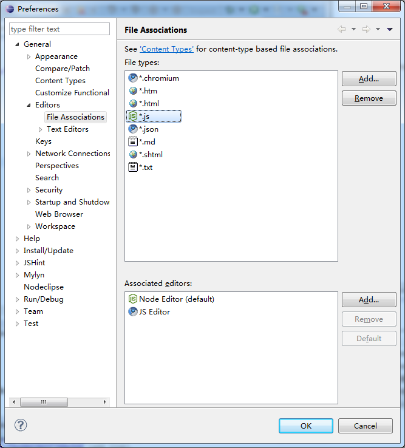

Alternatively, if you need/like good Outline, you can install JSON Editor plugin.

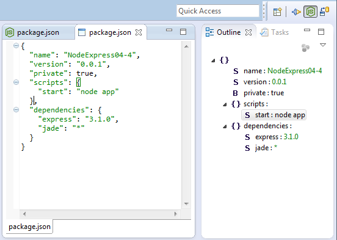

### Editor Minimap

There is experimental support for minimap.

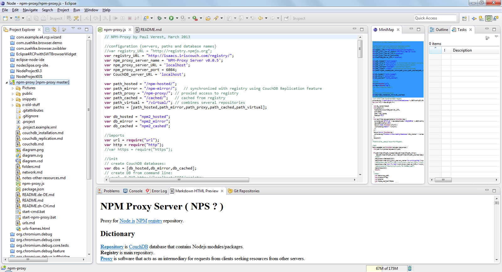

(Only in Nodeclipse [NTS](http://www.nodeclipse.org/nts/), close when don't like)

## Launch npm

1. (Switch to Node perspective)

2. run as ->  npm....

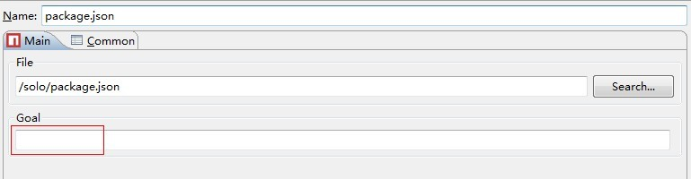

See also [npm documentation](https://npmjs.org/doc/)


Thank to George Pang for question.

## Quick Search

Press <kbd>Ctrl+Shift+L</kbd> to open QuickSearch Dailog, where you can search anything anywhere superquick.

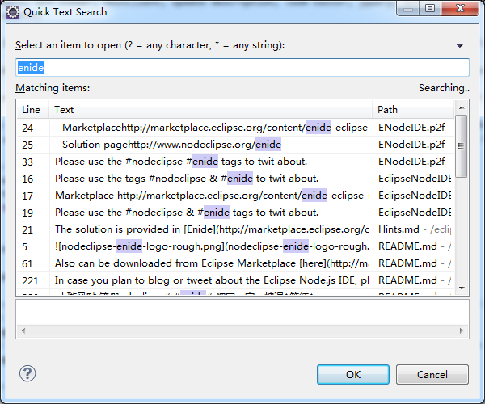

## Start Explorer or Shell

Right-click folder in Project Explorer or selected path in an Editor, then

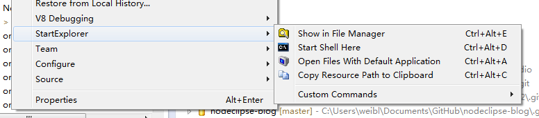

## Git

Press Ctrl+Shift+3 to commit current file or file set.

### Update several Git repositories at once

Just select them with mouse (holding Ctrl)  
Right-click any of them Team -> Pull  
See result.

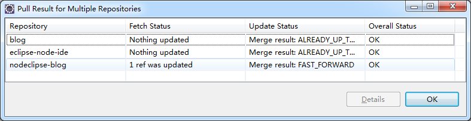

### Conflict resolution

When pulling, EGit (as any Git) does fetch then merge.  
EGit will show error message if change conflict has happened. And Merging will stop.

You can use Team -> Synchronize, to compare local git workspace and with git repository.

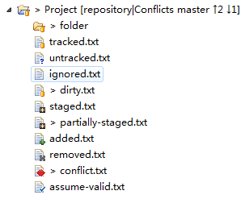

Then you may select Replace With -> Branch, Tag, or Reference...

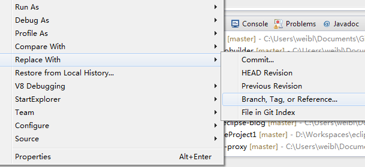 

### GitHub Flavored Markdown (GFM) Viewer

See markdown .md files as they are on GitHub. Very useful when browsing `node_modules` folder. Minimum recommended version is 1.1.1 .

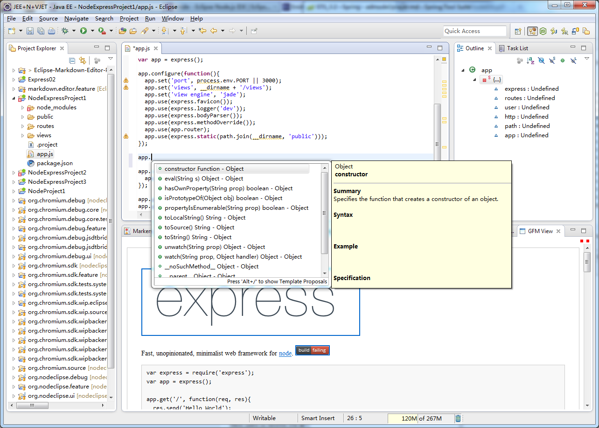

To open GFM View right click any .md file and select <kbd>Show in GFM view</kbd>. (Since 1.1.1 in Enide 0.4.10)

### Connect Eclipse to GitHub issues

STS comes with EGit and GitHub support, that includes
 [Mylyn GitHub Connector](http://marketplace.eclipse.org/content/github-mylyn-connector).
<a href="http://marketplace.eclipse.org/marketplace-client-intro?mpc_install=1147" class="drag">
</a>

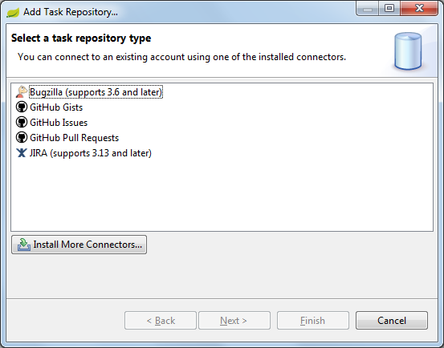

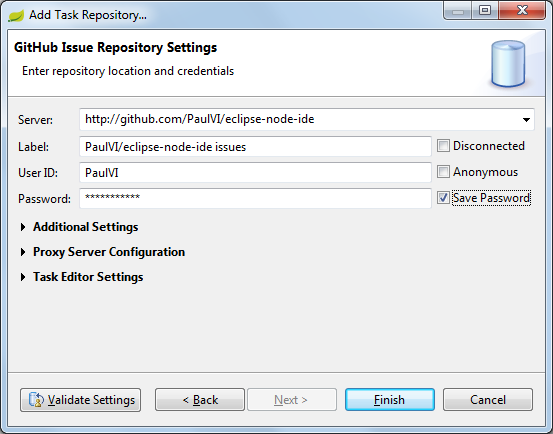

You need to add at least 1 query

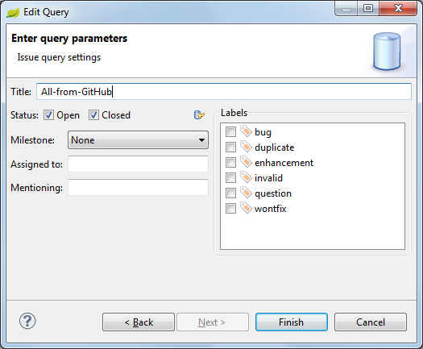

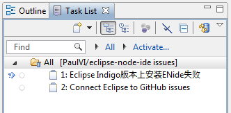

See more at [GitHub:teach](http://teach.github.com/articles/github-issues-cheatsheet/):

- [Tips and Tricks: Using Eclipse with GitHub(http://eclipsesource.com/blogs/2012/08/28/tips-and-tricks-using-eclipse-with-github/)  by Ian Bull
- [GitHub Eclipse page](http://eclipse.github.com/)

## REST Client

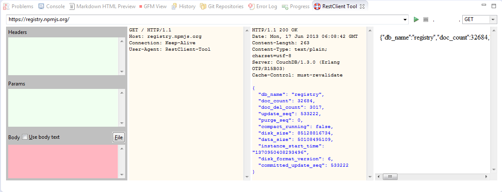

This one has not been updated for a long while. [Sources are still on SVN](http://svn.codespot.com/a/eclipselabs.org/restclient-tool/).

## Shell script support

Included as option since 0.4.11

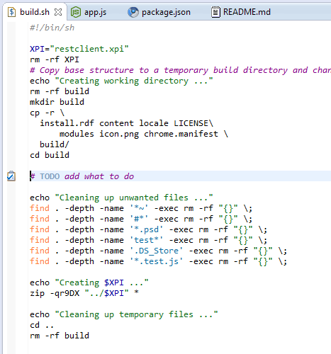

<https://sourceforge.net/projects/shelled/>
<http://shelled.sourceforge.net/>

## Keys

Press <kbd>alt</kbd> + <kbd>shift</kbd> + <kbd>A</kbd> to ***Toggle block selection** (<kbd>option/alt</kbd>+<kbd>command</kbd>+<kbd>A</kbd> on Mac)

Check current binding in Window->Preferences->General->Keys

From [Eclipse Help](http://help.eclipse.org/juno/index.jsp?topic=%2Forg.eclipse.platform.doc.user%2Ftasks%2Ftasks-51.xhtml):

- Use <kbd>Alt+Shift+W</kbd> to open Properties or other associated Views.

- All text editors based on the Eclipse editor framework support editing functions, including moving lines up or down (Alt+Arrow Up and Alt+Arrow Down), copying lines (Ctrl+Alt+Arrow Up and Ctrl+Alt+Arrow Down), inserting a new line above or below the current line (Ctrl+Shift+Enter and Shift+Enter), and converting to lowercase or uppercase (Ctrl+Shift+Y and Ctrl+Shift+X).

## Eclipse Standard 

Eclipse Standard doesn't have HTML Editor included.

In order to get HTML Editor

- check Nodeclipse Plugin List plugin or HTML Editor (standard on Marketplace)

or 

TODO update

- for Kepler `http://download.eclipse.org/releases/kepler` update site, just select JSF Tools - Web Page Editor
- for Juno `http://download.eclipse.org/releases/juno` update site, just select Web Page Editor

http://download.eclipse.org/webtools/downloads/ is [not updated yet for Kepler](https://bugs.eclipse.org/bugs/show_bug.cgi?id=414373).


