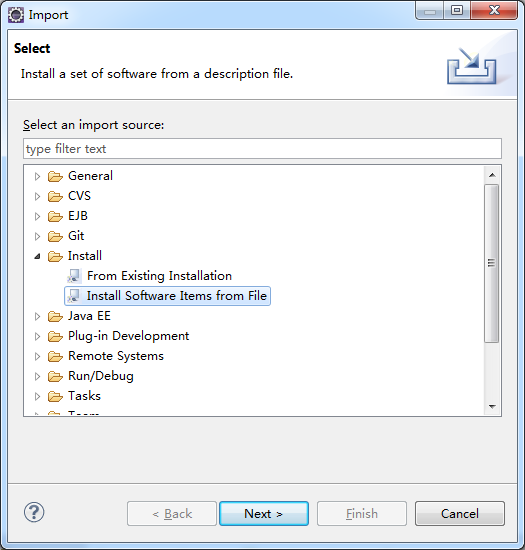

# Eclipse Node.js IDE

[Enide](http://en.wikipedia.org/wiki/Enide): will you love me forever?

 

Moved from [https://github.com/PaulVI/eclipse-node-ide](https://github.com/PaulVI/eclipse-node-ide)
 to [https://github.com/Nodeclipse/eclipse-node-ide](https://github.com/Nodeclipse/eclipse-node-ide) .

Check [Nodeclipse team blog](https://github.com/Nodeclipse/nodeclipse-blog#blog) for latest updates.

## Eclipse Node IDE

[Eclipse Node IDE](https://github.com/Nodeclipse/eclipse-node-ide) is set of plugins for Eclipse IDE to help you with Node.js development.
The core plugin is [Nodeclipse-1](http://tomotaro1065.github.com/nodeclipse/) [(sources)](https://github.com/Nodeclipse/nodeclipse-1),
 that is responsible for creation and debugging of Node.js applications.

## Features

Shell Script support (see Hints.md)
 
## Usage

Check out [great article](http://www.tomotaro1065.com/nodeclipse/)
 and [watch video](http://tomotaro1065.github.com/nodeclipse/index2.htm).
 (Go to 2:00 time to skip installation and see how to work within Eclipse.)  
 
See also [Hints.md](https://github.com/Nodeclipse/eclipse-node-ide/blob/master/Hints.md#hints) for

* [JSON Editor](https://github.com/Nodeclipse/eclipse-node-ide/blob/master/Hints.md#json-editor)
* [Launch npm](https://github.com/Nodeclipse/eclipse-node-ide/blob/master/Hints.md#launch-npm)
* [Update several Git repositories at once](https://github.com/Nodeclipse/eclipse-node-ide/blob/master/Hints.md#update-several-git-repositories-at-once)
* [Connect Eclipse to GitHub issues](https://github.com/Nodeclipse/eclipse-node-ide/blob/master/Hints.md#connect-eclipse-to-github-issues) 

## Installation

### In a few words

Just import "ENodeIDE.p2f" file [provided](https://raw.github.com/Nodeclipse/eclipse-node-ide/master/ENodeIDE.p2f).  
Also can be downloaded from Eclipse Marketplace [here](http://marketplace.eclipse.org/content/enide-eclipse-nodejs-ide).

Firefox: <kbd>File</kbd> <kbd>Save Page As</kbd>  
Google Chrome: <kbd>Ctrl + S</kbd>  
Internet Explorer: <kbd>File</kbd> <kbd>Save as</kbd>

File -> Import \ Install Software Items from File

Note: if it fails for any reason, you can still install plugins that you need one by one.
Just use <code>repository location=</code> value as update site in Help -> Install New Software. 

### Detailed

([Skip to Configuration](https://github.com/Nodeclipse/eclipse-node-ide/#configuration)) 

   1) Get latest Eclipse from [http://www.eclipse.org/downloads/](http://www.eclipse.org/downloads/).  
Recommended is [Eclipse IDE for Java EE Developers](http://www.eclipse.org/downloads/packages/eclipse-ide-java-ee-developers/junosr2)
 Juno (4.2) SR2,
that contains Eclipse web tools.

(I have also succeeded to install on

* [Eclipse for Testers](http://www.eclipse.org/downloads/packages/eclipse-testers/junosr2),
 the smallest Eclipse distribution, just 95 MB.
* [Spring Tool Suite (STS)](http://www.springsource.org/sts) 3.2.0.RELEASE
* See [Tested platforms](https://github.com/Nodeclipse/nodeclipse-blog#tested-platforms)
 )

 

It comes already with EGit, so you already have tool to work with [GitHub](https://github.com/) or any git server.

   2) Get NodeIDE.p2f and save it.

   3) Then in Eclipse File -> Import \ Install Software Items from File

   4) Select file and items you want to install.

   5) Review and confirm installed items.

After installation you have more icons in Help -> About Eclipse

## Configuration

Some recommended configuration:

Goto Window->Preferences 

General select Show heap status  
General->Workspace -> Text file encoding select other UTF-8  
(if Eclipse 4.x Chrome Theme (Optional) installed)  
General->Appearance ->Theme select Jeeeyul's themes - Chrome Theme, restart Eclipse

Switch to Node perspective (e.g. Window -> Open Perspective -> Other ... -> Node)
  
Window -> Show View -> Other... -> Markdown -> Markdown HTML Preview  
(Very useful when exploring <code>node_modules</code> folders) 

## Usage in pictures

Switch to Node perspective (e.g. Window -> Open Perspective -> Other ... -> Node)

Create new Node project 
Alt+Shift+N (File -> New -> Project ..)

Create new Express project 
Alt+Shift+N (File -> New -> Project ..)

IDE overview

## License 

Copyright (C) 2013, by [Paul Verest](https://github.com/PaulVI/blog#blog) at [Funshion.com](http://www.funshion.com/english/index.html)

You can do whatever you want with this projects as long as you keep this license notice.

## Status

Current version is 0.3, the same as [Nodeclipse-1](http://tomotaro1065.github.com/nodeclipse/).
New project development home is [Nodeclipse organization](https://github.com/Nodeclipse/)
You can help by developing used plugins, or proposing new plugins/components.

<!--
DONE:
[provided link](http://github.com/downloads/Nodeclipse/eclipse-node-ide/EclipseNodeIDE-0.2.p2f). 
([how to link](http://stackoverflow.com/questions/13441720/download-binary-file-from-github-using-java))
 -->
 
Help needed! Please [contact](#contacts) if you want to help or know anything helpful for JavaScript Development in Eclipse.

## Contacts

Reminder: This project is set of plugins, if you have question about functioning of a plugin, please look for the project contacts. 

<!-- 
http://stackoverflow.com/privileges/create-tags
-->

* How do I? -- StackOverflow!
* I got this error, why? -- StackOverflow!
* I got this error and I'm sure it's a bug -- file an issue!
* I have an idea/request -- file an issue!
* Why do you? -- the mailing list!
* When will you? -- the mailing list! 

Should you report a [bug](https://github.com/Nodeclipse/eclipse-node-ide/issues), please include the following:

* Eclipse version number (like 4.2.2 or 3.8.0)
* A detailed description of the steps necessary to reproduce the problem.
* The '.log' file from the directory '.metadata' in your workspace.

Eclipse Node.js IDE (Enide) by [Paul Verest](mailto:paul.verest@live.com?subject=Enide - Question
&body=I have pressed link in README.md&attachment="c:\a.bmp")

**Node.js framework developers, please help us to support your framework with Nodeclipse and Eclipse Node.js IDE.**

If you want to contribute and actively work together, then [email](mailto:paul.verest@live.com?subject=Enide - Development
&body=I want to contribute to Eclipse Node.js IDE&attachment="c:\a.bmp")  
Skype pverest  
QQ 908781544  

## For Bloggers and Users of Twitter, Flickr, LinkedIn, Weibo etc.

In case you plan to blog or tweet about the Eclipse Node.js IDE, please use the tag "#enide"
 in order to make it easier to find all the comments and pictures. Thanks a lot for telling the world about the project!  
  | 请用 ＃nodeclipse# #enide# 标签微博一下。  
  | Por favor, utilizar etiqueta ＃nodeclipse #enide  
  | ツイートする時は、＃nodeclipse ＃enide タグを使用してください。   
  | Bitte benutzen Sie tag ＃nodeclipse #enide um zu twiten.

